这篇文章是 SOSP'17 的 best paper，贡献在于提出了第一个系统性的深度学习系统白盒测试框架，并提出了**神经元覆盖率(neuron coverage)**这一个测试度量标准。主要思路是根据 seed input 自动生成 test input，尽可能触发 DNN 产生不同/错误行为(erroneous behaviors)，同时最大化神经元覆盖率，这两者结合起来做联合优化。

论文见 [DeepXplore: Automated Whitebox Testing of DL Systems](http://delivery.acm.org/10.1145/3140000/3132785/p1-pei.pdf?ip=125.220.157.241&id=3132785&acc=ACTIVE%20SERVICE&key=BF85BBA5741FDC6E%2E4977B3C8BBB4AEC7%2E4D4702B0C3E38B35%2E4D4702B0C3E38B35&__acm__=1525516510_504c48fac8a7e35ab163026fb6d8e53b)

# Background

随着深度学习 (DL) 的迅速发展，其在一些安全攸关的系统中有了诸多部署，例如自动驾驶、恶意代码检测等。DL 系统的预测能力和准确率在这些应用中尤为重要，然而模型可能过拟合/欠拟合等，在一些极端条件 (corner case) 下表现欠佳。 总的来说对所有极端情况下的大规模的深度学习系统进行自动、系统化测试极具挑战性。

现有的深度学习系统测试存在以下局限性：

  - 高成本的人工标记工作
  
    特别是当输入的是高维且复杂的数据时，人工也很难给出正确的输出判断

  - 测试覆盖率低

    

    
    

    传统的软件测试和 DNN 测试有一定相似之处，虽然 DNN 并没有显式的路径或分支，但从上面的图可以看出，下游神经元会受上游神经元影响，影响程度随上游神经元输出值大小而有所不同。因此，作者认为对于 DNN 来说，覆盖率也是很重要的因素。覆盖率低的 test input 会使很多错误行为不被探测到。然而现有的 DL 系统测试方法基本上都没有考虑去覆盖 DNN 的不同逻辑，这样即使有大量测试输入也很难发现系统的 erroneous bahaviors。

作者在文章中还提到了目前比较火的对抗样本 (adversarial samples) 生成技术，对抗样本虽然能使 DNN 出错，但用于测试时的局限性在于，添加的扰动必须是微小且不可见的，而且对抗样本只覆盖 DNN 大概50%的逻辑 (作者在实验部分将 DeepXplore 和 adversarial testing 做了比较)。 我个人认为本文方法的思想和FGSM 类似，都是基于梯度的方法，使 DNN 达到产生不同决策的临界点 (如下图)，多了对 neuron coverage 的考量。

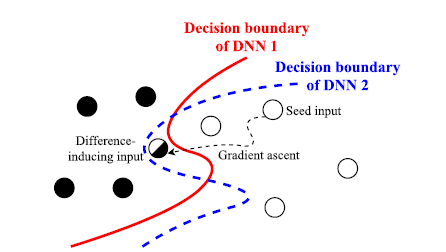

因此，关键问题变成：怎样使生成的 test input 尽可能覆盖 DNN 的不同逻辑，从而揭示不同的错误行为；不采用人工标记的情况下，怎样判断错误行为。 作者给出的解决思路是：引入**神经元覆盖率 (neuron coverage)** 来度量 DL 系统的覆盖； 利用功能相似的多个 DNN 作交叉引证 （cross-referencing)，解决 DL 系统的 oracle 问题，避免人工检查。

# Overview of DeepXplore

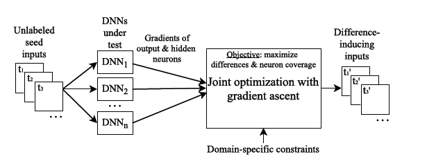

首先来看一下 DeepXplore 这个框架的工作流：将一系列未标记的图片作为 seed input，输入到一些预训练的 DNN 中(这些 DNN 功能相似，例如对同一个 seed image，需给出相同的分类结果)；由于是预训练网络，参数都是固定的，所以作者将权重作为常量、input 作为变量，定义基于整个网络输出和基于隐藏层神经元输出的两种损失函数；采用梯度上升 (gradient ascent) 方法做联合优化，不断地调整 input 变量。注意在联合优化过程中，为保证产生的新测试输入是有效且符合真实场景的，该框架还引入了领域约束条件，例如只能调整图片的明暗度而不改变图片内容等等。DeepXplore核心内容包括：

  - Maximizing differential behaviors
  - Maximizing neuron coverage
  - Joint optimization
  - Domain-specific constraints

这几点会在后面详细介绍，接下来介绍2个重要概念。

# Definitions

## Neuron Coverage

> We define neuron coverage of a set of test inputs as the ratio of the number of unique activated neurons for all test inputs and the total number of neurons in the DNN.

神经元覆盖率是本文的重要概念，也就是被激活的神经元数目占总神经元数目的比例。若考虑一组测试输入， 那么计算覆盖率时只考虑被唯一激活的神经元。公式如下 (懒得手打公式了，直接贴图)：

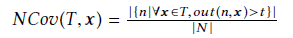

(n 表示一个神经元，N 为神经元总数，x 为 test input, t 为判断神经元是否激活的阈值)

每个神经元倾向于独立提取输入的特定特征（见原文参考文献 [58，87])，即每个神经元学习到的是不同的 rules，作者认为这是把神经元覆盖率作为 testing metric 的一个很好的解释。

## Gradient

梯度这个概念大家都很熟悉了，直接给出公式：

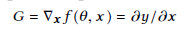

# Methodology

下面给出了 DeepXplore 的核心算法，后面会按上文提到的四个模块分别介绍

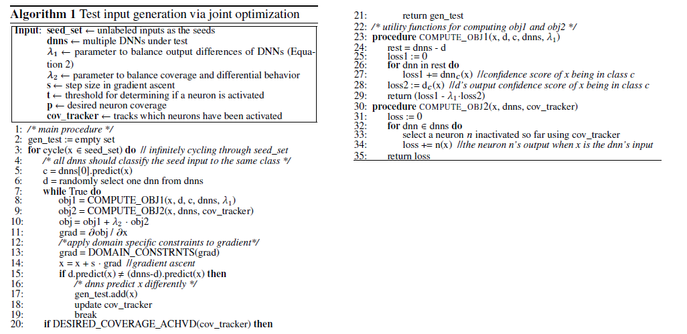

## Maximazing differential behaviors

对于任意一个输入 x 和多个 DNN，该模块目的是生成的新的测试输入 x' ，x' 使至少一个 DNN 产生不同的预测结果。用下面的图作为例子，对原始输入进行变换后的新输入使两个功能相似的 DNN 产生了不同的分类结果：

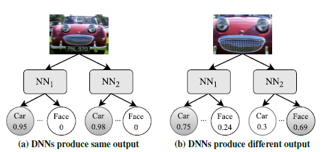

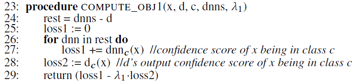

我们看算法的 23-29 行：从 DNNs 中随机选择一个目标 DNN (Fj)，分别计算 Fj 和 剩余 DNNs 将 x 分类为 c 的置信度，返回如下的目标函数 (λ1是预定义的平衡参数)：

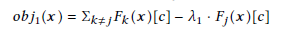

## Maximazing neuron coverage

见算法的 30-35 行，最大化神经元覆盖率的方法是随机挑选一个当前还未被激活的神经元，修改 x 使该神经元输出超过某阈值，该过程迭代进行。所以这一部分要优化的目标函数就是神经元的输出 fn(x) (这里的 n 表示未激活的神经元)。

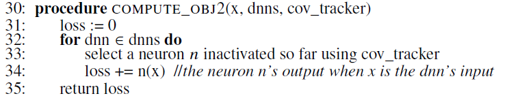

## Joint Optimization

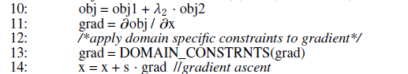

联合优化的方法是先将前面两个模块的目标函数结合起来，计算联合函数的梯度，再利用梯度上升法更新 x。联合目标函数公式如下 (λ2 为平衡两个目标函数的超参数)：

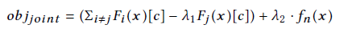

## Dominant-specific constraints

引入领域约束条件是为了使生成的 test input 更符合实际情况。文章给出了自动驾驶， MNIST 和 ImageNet 数据集的例子，我这里只展示自动驾驶的两个例子。一种是改变图片的明暗来模拟现实场景的不同光线；一种是增加 m*n 像素的黑色小方块，模拟镜头上的污点，见下图：

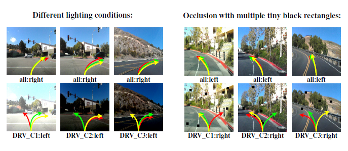

作者在文中提出的约束条件 (也就是图像转换) 是可以被梯度有效地引导 (计算) 的，然而这也带来一个问题，就是对图像的约束不够灵活。生成的新输入只相当于用于训练的输入加上一些小改动，感觉就是一种数据增强。

# Experimental Result

作者在 MNIST， ImageNet，Driving，Contagio/Virustotal (PDFs)，Drebin (Android apps) 五种数据集上进行了实验，用的 DNN 是一些各数据集上的经典模型。DeepXplore最终在被测 DNN 上总共发现了数千种错误行为，结果还是很可观的。

实验结果表明，神经元覆盖率 (neuron coverage) 是一个有效的测试度量标准。表现在：仅用一小部分随机测试用例都能使代码覆盖率达到 100%，而此时的神经元覆盖率仅仅为 30% 左右；不同种类的输入与同类输入相比，激活的 unique neurons 更多；neuron coverage 上的微小增长也会提高 input diversity。

作者最后比较了DeepXplore，adversarial tetsing 和 random testing 的 performance (以neuron coverage 作为 metric)，结果显而易见了：

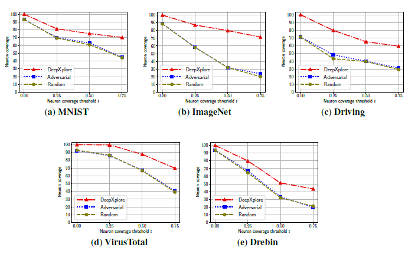

# Summary

之前看这篇 paper，在思考这样一个问题：作者定义的 neuron coverage 是对整个网络来说的，其实是个很笼统的概念，并没有统计不同 "路径" 下神经元被覆盖的数目，我其实更想知道不同特征下的神经元，分别被激活了多少。影响 CNN behaviors 的重要因素应该是提取了图像哪个部位的特征，是否是提取的特征的差异导致了输出的差异，如果是，那么怎样的特征差异会导致输出产生较大的差异？这一点我很疑惑。

然而近期重新看文章终于注意到 "each neuron in a DNN tends to independently extract a sepcific feature of input instead ..." 这句话，我在前面也说了，这是对以神经元覆盖率作为 testing metric 的一个直观解释。如果每个神经元提取的是不同类型的特征，那么高的覆盖率的确意味着信息上的差异，不过这也只是从"量"的角度去考虑，其实"质"应该更重要吧。这个问题还需要继续思考~

Yoav Hollander 在 [DeepXplore and new ideas for verifying ML systems](https://blog.foretellix.com/2017/06/06/deepxplore-and-new-ideas-for-verifying-ml-systems/) 这篇博客中，对 DeepXplore 以及 ML systems verification 有很深入的思考，提了很多有趣的问题，也包括对作者所做工作的建设性意见，DeepXplore 作者也给予了回复。 几个 idea 我觉得挺有参考价值的，我也得反思下我读完 paper 怎么就没有考虑到这些问题 (当然是功力太浅)。在这里列出几个我感兴趣的问题：

**1.关于神经元覆盖**

> Neuron coverage is really implemention coverage, and implemention coverage is not enough, mainly becuase it does not help with bugs of omission... If you forgot to train your driving DNN on dirving-on-left ... then you may have 100% coverage on a very buggy system.

Hollander 认为，"实现覆盖" 在没有考虑到系统的某些漏洞的情况下也能达到100%的覆盖率，对 DNN 来说也是这样。作者在回复中也说，他们试图扩展神经元覆盖的定义，使它能包含神经元路径覆盖：
> Full neuron coverage (just like code coverage) will not provide any guarantees about all possible bugs. That being said, we are also thinking about extending the definition of neuron coverage to include different types of coverage (e.g., neuron path coverage just like path coverage in traditional software)

**2.关于约束条件**

> My favorite solution for most of verification is some variant of CDV (覆盖驱动验证). Thus, I am hoping to create constrained-random, model-based inputs for verifying all systems, including DNN-based systems. The DeepXplore folks talk only about taking existing inputs and mutating them somewhat. It would be interesting to look for some combined way.

作者回复：

> ... coming up with realistic models/constraints for data like images is a hard problem in itself. In DeepXplore, we start with the realistic input hoping that the mutated sample will be valid and therefore can appear in the wild. We also tried starting with random samples and found that DeepXplore can identify difference-inducing inputs, but they do not look like an image that do not look real.

作者还提到他们正在考虑使用生成对抗网络 (GAN) 来研究如何生成较真实的图像。GAN 的确能帮助生成某种意义上直接的、真实的输入，但 Hollander 认为这样"新颖性"会受限。Hollander 说，他期望 " input generation starts from some constrainable, high-level description"，例如从文本到图像的 DNN，通过对文本的干扰，得到不同的输出。这样还可以将 DNN 应用到更复杂的场景，比如「一辆从左边开来的车、站在右边的狗、以及刚刚变绿的信号灯这三者的结合」，实现输入的复杂性和多样性。