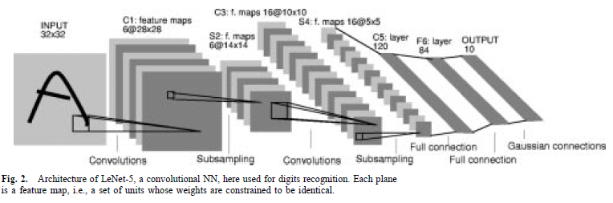
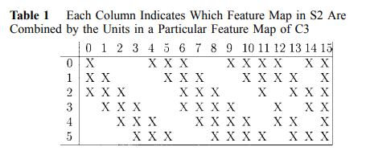

LeNet-5 是 Yann LeCun 提出的经典 CNN 模型，本篇介绍 LeNet-5 的结构以及在 TensorFlow MNIST 数据集上的实现。

论文见 [Gradient-based learning applied to document recognition](https://ieeexplore.ieee.org/abstract/document/726791/)

# LeNet-5 结构

首先看一下 LeNet-5 的整体结构：

我们将卷积层用 Cx 表示，池化层用 Sx 表示，全连接层用 Fx 表示。 可以看到 LeNet-5 其实是7层结构（不包括输入层）。

**输入层**

输入为 32x32 pixel 的图像

**C1 层**

第一层为卷积层，有 6 个 5x5 大小的卷积核（kernel），卷积步长为1。得到 6 个 28x28 大小的 feature maps

feature map 大小计算：**(original_size+padding_sizex2-kernel_size)/strides+1**，即(32-5)/1+1=28。（注意 MNIST 数据集大小为 28x28，所以这里 padding_size 为 2）

训练参数个数： 共 6 个卷积核，每个卷积核大小为 5x5，则共有 6（5x5+1）= 156 个参数。这里加 1 是每个卷积核最后加上的一个bias。可以看到权值共享可以大大减少参数个数。

**S2 层**

第二层为池化层。设采用最大池化 max_pooling，窗口大小为 2x2，滑动步长为 2，池化后得到 6 个大小为 14x14 的feature maps。参数共 2x6=12 个。

**C3 层**

第三层为卷积层，有 16 个 5x5 卷积核，卷积步长为 1。卷积后得到 16 个 10x10 大小的 feature maps ((14-5)/1+1=10)。每个 feature map 与 S2 层的连接方式如下：

可以看到，并不是每个 C3 层的 feature map 都与每个 S2 层的 feature map 相连。论文中说到采用这种连接方式的两种原因：适当减少参数；打破网络的对称性，从而不同的 feature maps 能从不同的输入组合中提取不同特征。

我们来算一下这一层的训练参数个数：feature map 0-5 分别与 S2 层 3 个连续的 feature maps 相连，有 6x(3x5x5+1)=456 个参数； feature map 6-11 分别与 S2 层 4 个连续的 feature maps 相连，有 6x(4x5x5+1)=606 个参数； feature map 12-14 分别与 S2 层不连续的 4 个 feature maps 相连，有 3x(4x5x5+1)=303 个参数； 最后一个 feature map 与 S2 层全部 6 个 feature maps 相连，有1x(6x5x5+1)=151 个参数。总共的训练参数为：456+606+303+151=1516 个。

**S4 层**

第四层为池化层。与 S2 一样，最大池化后得到 16 个 5x5 的 feature maps。参数共 2x16=32 个。

**C5 层**

第五层为卷积层，有 120 个 5x5 大小的 卷积核，分别与 S4 层的每一个 feature map 相连。卷积后得到 120 个 1x1 大小的 feature maps ((5-5)x1+1=1)。训练参数：120x(16x5x5+1)=48120 个。

**F6层**

第六层为全连接层，有 84 个 节点，与 C5 层 120 个 节点全连接。该层参数有（120+1）x84=10164 个。F6 层的节点数是根据输出层设计的，至于为什么，论文中有解释，目前我还没仔细看，等看懂了来补充。

**output 层**

第七层为输出层，共 10 个节点，对应 0-9 这 10 个类。该层参数为 84x10 = 840 

---

# TensorFlow 实战

## 权重和偏置初始化

将权重矩阵初始化为正态分布，标准差为 0.1：
<pre><code>def weight_init(shape):
    initial = tf.truncated_normal(shape, stddev=0.1)
    return tf.Variable(initial)
</code></pre>

初始化bias为一个常量tensor：
<pre><code>def bias_init(shape):
    initial = tf.constant(0.1, shape=shape)
    return tf.Variable(initial)
</code></pre>

## 定义卷积和池化操作

### 卷积
<pre><code>def conv2d(x, W):
    return tf.nn.conv2d(x, W, strides=[1, 1, 1, 1], padding='VALID')
</code></pre>

输入参数为 input x, filter W。x 的 shape 为 [batch_size, height, weight, channel]，是 4 维张量； W 的 shape 为 [height,weight,num_in,num_out]，也是 4 维张量。此外卷积步长设为 1，padding 设为 'VALID'，即将多余元素丢弃。也可设置为另外一种 padding 方式 'SAME'，是在图像左右对称补 0，使滑动窗口刚好滑动到图像边界。

### 池化
<pre><code>def max_pool(x):
    return tf.nn.max_pool(x, ksize=[1, 2, 2, 1], strides=[1, 2, 2, 1], padding='VALID')
</code></pre>

这里采用最大池化(max_pooling)。滑动窗口为 2x2，步长为 2，padding 方式也设为 'VALID'。

## 定义卷积和全连接层

### 卷积层

卷积层运算方式为：输入与核函数进行卷积运算，之后加上一个偏置，作为激活函数的输入。这里用到的激活函数为 ReLu

<pre><code>def conv_layer(x, weight, bias):

    W_conv = weight_init(weight)
    b_conv = bias_init(bias)

    h_conv = tf.nn.relu(conv2d(x, W_conv) + b_conv)
    h_pool = max_pool(h_conv)

    return h_pool
</code></pre>

### 全连接层

全连接层运算方式为：f(x*W+b)，x 与 W 为点乘。激活函数为 ReLu

<pre><code>def fc_layer(x, weight, bias):

    W_fc = weight_init(weight)
    b_fc = weight_init(bias)

    h_fc = tf.nn.relu(tf.matmul(x, W_fc) + b_fc)

    return h_fc
</code></pre>

## 定义网络结构
 
由于我加了一个 dropout 层，所以输入参数除了 raw image 之外还有一个 drop out rate。

MNIST 数据集图片大小为 28x28，所以我们要先将图片填充为 32x32 大小再输入到网络中。h1 对应 C1+S2，h2 对应 C3+S4，h3 对应 C5，h4 对应 F6。

<pre><code>def model(x, keep_prob):

    # input layer
    # padding the input image to 32*32
    x_image = tf.pad(tf.reshape(x, [-1, 28, 28, 1]), [[0, 0], [2, 2], [2, 2], [0, 0]])

    # Layer 1
    h1 = conv_layer(x_image, [5, 5, 1, 6], [6])

    # Layer 2
    h2 = conv_layer(h1, [5, 5, 6, 16], [16])

    # Layer 3
    # convolution without pooling
    weight = weight_init([5, 5, 16, 120])
    bias = bias_init([120])
    h3 = tf.nn.relu(conv2d(h2, weight) + bias)
    h3_flat = tf.reshape(h3, [-1, 120])

    # Layer 4
    # fully-connected layer
    h4 = fc_layer(h3_flat, [120, 84], [84])

    # Layer 5
    # output layer, fully-connected
    # l_ : probability vector
    h4_drop = tf.nn.dropout(h4, keep_prob)
    weight = weight_init([84, 10])
    bias = bias_init([10])
    l_ = tf.nn.softmax(tf.matmul(h4_drop, weight) + bias)

    return l_
</code></pre>

## 训练

我这里只展示一些关键步骤，详细代码可见我的 [github](https://github.com/setezzy/DLforCBIR/tree/master/LeNet5)。

<pre><code>    cross_entropy = -tf.reduce_sum(label * tf.log(l_))

    train_step = tf.train.AdamOptimizer(1e-4).minimize(cross_entropy)
    correct_predict = tf.equal(tf.argmax(l_, 1), tf.argmax(label, 1))
    accuracy = tf.reduce_mean(tf.cast(correct_predict, tf.float32))

    for i in range(20000):
        batch = mnist.train.next_batch(50)
        if i % 100 == 0:
            # print the log every 100 steps
            train_accuracy = accuracy.eval(
                feed_dict={
                    x: batch[0],
                    label: batch[1],
                    keep_prob: 1.0
                })
            print("step %d, training accuracy %.4f" % (i, train_accuracy))

        train_step.run(feed_dict={
            x: batch[0],
            label: batch[1],
            keep_prob: 0.5
        })
</code></pre>

损失函数用 cross_entropy， 优化算法用的是 Adam，learning rate 设置为 0.0001。对于 20000 张训练图片，每次进 50 张，训练时的 drop out rate 设为了 0.5。