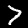
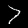

这一篇主要记录一下自己基于 keras 做数据增广 (data augmentation) 的经验。

由于实验需求，我需要对数据集做一些不同的增广变换，并得到增广训练后的模型。数据增广的方法网上资料有很多，基本的变换例如裁剪/旋转/缩放/翻转等，大家熟悉的 `skimage` 以及 `keras.preprocessing` 模块也提供了基本方法。

很多人在做数据增广时会用 keras 来实现，而 keras 非常便利的一点是它提供了 `ImageDataGenerator()` 函数以支持实时的图像生成，可以在[官方文档](https://keras.io/preprocessing/image/#imagedatagenerator-class) 查看所有参数。我们通过向 `ImageDataGenerator()` 传入相应参数来创建一个图像生成器，然后在该图像生成器上调用 `.fit()` 方法，它将一个 batch 一个 batch 地修改图像 (是否修改图像是随机的)，从而实现实时的数据提升。虽然 keras 的预处理模块已经提供了不少的增广方法，我还是想增加一些新的变换，并能够在 `ImageDataGenerator()` 中调用。 

参考了资料之后，我了解到可以对 `keras.preprocessing.image` 进行修改和扩充，增加我们所需的方法。我们将采取以下几个步骤：  

- 找到自己电脑上的 keras 安装路径，将 preprocessing 文件夹下的 image.py 文件复制一份到当前工作路径 (这样能确保版本一致)
- 添加自己的方法，并添加相应属性到 `ImageDataGenerator()`类的 `__init__()` 方法中 
- 找到 `random_transformation()`，添加 if 语句，这样当调用 `.fit()` 时相应的 augmentation 方法就会被执行。     

**image.py 路径**     

执行以下命令查看本机 keras library 路径，在 preprocessing 文件夹下找到 image.py：
<pre><code>print(keras.__file__)
</code></pre>          

**修改 image.py**

本文给出两个扩充MNIST数据集的例子：图像腐蚀 (erosion)、增加椒盐噪声 (salt and pepper noise)。 
skimage 的 morphology 模块提供了图像腐蚀这种形态学变换，所以我们可以直接调用。椒盐噪声的实现比较简单，即随机挑选像素点，将像素值设为 0 或 255。

首先在 image.py 中先引入 skimage 模块，代码如下：   
<pre><code>from skimage import morphology as mp
</code></pre>  

在 `ImageDataGenerator.__init__()` 中增加相应属性 (我这里只列出增加的几行代码)：

<pre><code>class ImageDataGenerator(object):
    def __init__(self,
                 erosion=False,
                 noise=False):     
        self.erosion = erosion
        self.noise = noise   
</code></pre>     

`random_transformation()` 方法响应我们传入 `ImageDataGenerator()`的参数，我们需要做的是添加 if 语句，如果参数为 True 就执行相应方法：

<pre><code>def random_transformation(self, x):
    if self.erosion:
        if np.random.random() < 0.5:
            x = x.reshape(28, 28)
            x = mp.erosion(x, mp.square(2, dtype=np.uint8))
            x = np.expand_dims(x, axis=img_channel_axis)
    if self.s_p_noise:
        if np.random.random() < 0.5:
            x = x.reshape(28, 28)
            for i in range(50):
                row = np.random.randint(0, 28)
                col = np.random.randint(0, 28)
                x[row, col] = 1
                row_ = np.random.randint(4, 24)
                col_ = np.random.randint(4, 24)
                x[row_, col_] = 0
            x = np.expand_dims(x, axis=img_channel_axis)
    return x
</code></pre>
           
到这里准备工作就已经完成了。最后在训练时创建图像生成器，并调用 `fit_generator()` 给模型喂数据：

<pre><code> if train:
    # compiling
    model.compile(loss='categorical_crossentropy', optimizer='adadelta', metrics=['accuracy'])
    # augmenting
    datagen = image.ImageDataGenerator(erosion=True)
    datagen.fit(x_train)
    model.fit_generator(datagen.flow(x_train, y_train, batch_size=batch_size),
                        steps_per_epoch=x_train.shape[0] / batch_size,
                        epochs=20,
                        validation_data=(x_test, y_test))
     # save model
     model.save_weights('./model.h5')  
</code></pre>

注意 `fit_generator()` 中的 steps_per_epoch 参数，在 keras2.x 版本中含义为每个 epoch 要训练多少个 batch。例如 mnist 训练集有 60000 张， batch_size 为 256 时，steps_per_epoch 为 234。 在 keras1.x 中，该参数为 samples_per_epoch，就是每一轮要训练的样本数，应该为 60000。这个差别需要特别注意。   

我们可以通过以下代码将生成的图片保存到本地，以查看效果：
<pre><code>import image
import cv2
import numpy as np

datagen = image.ImageDataGenerator(spnoise=True)

# 我的目录结构为 /category/image index
img_path = './pics/source/7/18.jpg'
im = cv2.imread(img_path, cv2.IMREAD_GRAYSCALE).astype(np.float32)
x = im/float(255)
x = np.expand_dims(x, axis=0)
x = np.expand_dims(x, axis=3)

i = 0
for batch in datagen.flow(x, batch_size=1,
                         save_to_dir='pics',
                         save_prefix='7', save_format='jpeg'):
    i +=1
    if i > 10:
        break
</code></pre>

这里简单展示一下进行变换后的图像：

original：

    

erosion:

  

salt and pepper noise:

 

完整代码见我的 [github](https://github.com/setezzy/deep-learning/tree/master/augmentation)  

**Reference**    

[Image Augmentation for Deep Learning using Keras and Histogram Equalization](https://towardsdatascience.com/image-augmentation-for-deep-learning-using-keras-and-histogram-equalization-9329f6ae5085)                                                                                                                                                 