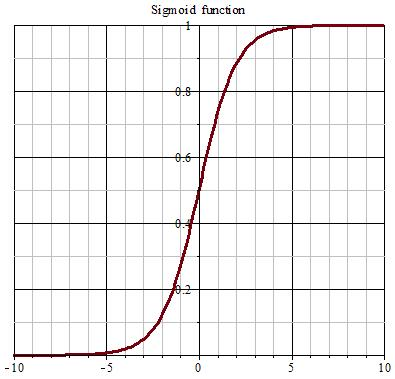
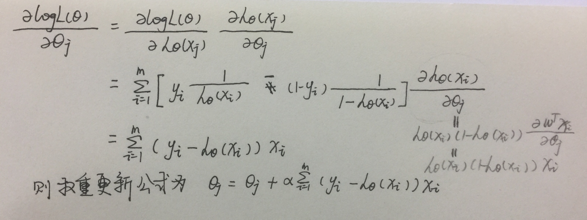
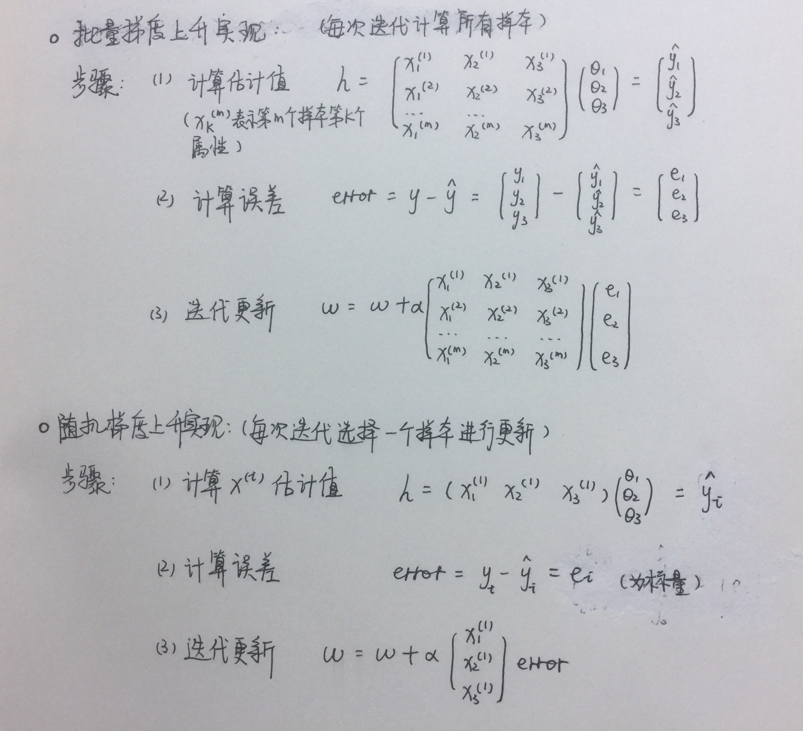
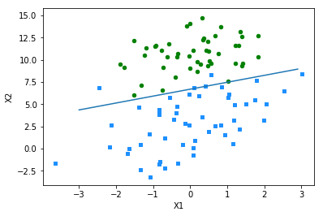
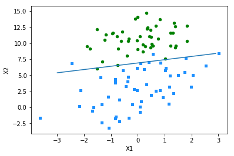

# Logistics Regression

Logistic Regression 译作对数几率回归。虽然听上去是一种"回归"方法，实际却是一种分类学习方法。它在广义线性模型的基础上，用一个单调可微函数将分类任务的真实标记与线性回归模型的预测值联系起来。这个单调可微函数通常称作预测函数，理想函数为单位阶跃函数，而单位阶跃函数为离散函数，我们需要找到一个类似的连续函数。**sigmoid** 便是我们通常采用的一种预测函数：





其表达式为：
$$ 
y = \frac{1}{1+e^{-z}} 
$$   

这里的 z 为线性回归函数 $ \textbf{w}^T \textbf{x} + b $

因此 sigmoid 函数可变化为：


$$ 
ln\frac{y}{1-y} = \textbf{w}^T \textbf{x} + b
$$

$\frac{y}{1-y}$ 称为几率（将 y 看作分类为正例的概率，则 (1-y) 为分类为负例的概率），取对数便得到对数几率函数。可以看出，该式子实质上是在用线性回归模型的预测值去逼近分类真实标记的对率。

接下来的任务就是求取对数几率函数的最优解。我们需要确定式中的参数 $\textbf{w}$ 和 b，通常采取的方法是**极大似然法**。

我们将 y 视作类后验概率估计 p(y=1|x)，那么上式可以重新写为：

$$
ln \frac{p(y=1 | x)}{p(y=0 | x)} = \textbf{w}^T \textbf{x} + b
$$

假设
$$
\textbf{w} = \{\theta_1, \theta_2, \cdots, \theta_m\}
$$

$$
h_{\theta} = \textbf{w}^T \textbf{x} + b
$$

则有：

$$
p(y=1 | x; \theta) = h_{\theta} (x)
$$


$$
p(y=0 | x; \theta) = 1 - h_{\theta} (x)
$$

合并得：

$$
p(y | x; \theta) = {h_{\theta}(x)}^y ( {1-h_{\theta}(x)})^{1-y}
$$

取对数似然函数：

$$ 
lnL{\theta} = \sum_{i=1}^m y_i lnh_{\theta} (x_i) + (1-y_i)ln(1-h\theta (x_i)) 
$$

使上式取得最大值时的 $\theta$ 即是我们求解的模型。这里就需要用到优化理论中的**梯度上升 (gradient ascent)** 法，求得参数的极大值：

$$
{\theta}_j = {\theta}_j + \frac{\partial{lnL(\theta)}}{\partial{\theta j}}
$$

求解过程如下：





采取梯度上升进行权重更新的具体实现如下：





# Demo

In[1]:

<pre><code>import numpy as np
import matplotlib.pyplot as plt
</code></pre>

首先载入一个包含n个实例的简单数据集, 每个实例的格式为 {x1 x2 label}， label取值仅为 0,1，为二分类：

In[2]:
<pre><code>def loadDataset(filepath):
    dataMat = []
    labelMat = []
    with open(filepath) as data:
        for line in data.readlines():
            arr = line.strip().split()
            dataMat.append([1.0, float(arr[0]), float(arr[1])])  # 增加了一列值为1的属性，方便后面矩阵运算
            labelMat.append(int(arr[2]))
    return dataMat, labelMat
</code></pre>

定义预测函数：

In[3]:
<pre><code>def sigmoid(z):
    '''
    sigmoid 函数
    Args:
        z: 线性回归模型的预测值
    Return: 
        sigmoid函数预测值
    '''
    return 1.0 / (1 + np.exp(-z))
</code></pre>

接下来定义梯度上升法更新权重 （此处为全局定步长梯度，即批量梯度上升）

In[4]:
<pre><code>def gradAscent(data, labels, alpha=0.001, maxIter=500):
    '''
    Args:
        data: 包含 n-d 特征的数据集
        labels: 标签集
        alpha: 步长(学习率)
        maxIter: 最大迭代次数
    Return:
        weights: 权重
    '''
    dataMat = np.mat(data)
    labelMat = np.mat(labels).transpose()  # 将label矩阵转置为列向量
    m, n = np.shape(dataMat)
    weights = np.ones((n, 1))  # 初始化权重矩阵（全零）
    for i in range(maxIter):
        y = sigmoid(dataMat*weights)  # 实质上是用线性回归模型的预测值逼近真实值的对数几率
        error = (labelMat - y)
        weights += alpha*dataMat.transpose()*error
    return weights
</code></pre>

In[5]:
<pre><code>dataMat, labelMat = loadDataset('./dataset/testSet.txt')
weights = gradAscent(dataMat, labelMat)
weights
</code></pre>


Out[5]:

    array([[ 4.12414349],
           [ 0.48007329],
           [-0.6168482 ]])


下面对分类决策边界进行可视化

In[6]:
<pre><code>def plotBestFit(weights):
    dataMat, labelMat = loadDataset('./dataset/testSet.txt')
    dataArr = np.array(dataMat)
    labelMat = np.array(labelMat)
    m = np.shape(dataArr)[0]
    xcord1 = []
    ycord1 = []
    xcord2 = []
    ycord2 = []
    for i in range(m):
        if int(labelMat[i]) == 1:
            xcord1.append(dataArr[i, 1])
            ycord1.append(dataArr[i, 2])
        else:
            xcord2.append(dataArr[i, 1])
            ycord2.append(dataArr[i, 2])
    fig = plt.figure()
    ax = fig.add_subplot(111)
    ax.scatter(xcord1, ycord1, s=20, c='dodgerblue', marker='s')
    ax.scatter(xcord2, ycord2, s=20, c='green')
    # 最佳拟合直线：1*w0 + w1*x1 + w2*x2 = 0
    # z = 0 时，预测值大于 0.5 为正例，反之为负例
    # 横轴为 x1, 纵轴为x2
    x = np.arange(-3.0, 3.0, 0.1)
    y = (-weights[0] - weights[1]*x) / weights[2]
    ax.plot(x, y.T)
    plt.xlabel('X1')
    plt.ylabel('X2')
    plt.show()
</code></pre>

In[7]:

```
plotBestFit(weights)
```





上面的梯度上升法每次读取一整个数据集来更新权重，当数据集过大时非常耗费计算资源,收敛过程也可能振荡。因此通常采取一种随机梯度上升法，每次随机选取一个batch的数据计算梯度并更新权重

In[8]:
<pre><code>def stocGradAscent(data, labels, maxIter=150):
    '''
    随机梯度上升（每次迭代随机选取一个instance）
    Args:
        data: 包含 n-d 特征的数据集
        labels: 标签集
        maxIter: 最大迭代次数（以保证快速收敛）
    Returns:
        weights: 更新的权重
    '''
    data = np.mat(data)
    labesl = np.mat(labels).T
    m, n = np.shape(data)
    weights = np.ones((n,1))
    for i in range(maxIter):
        dataIndex = list(range(m))
        for j in range(m):
            # 使学习率随迭代次数增大而减小
            alpha = 4 / (1.0 + i + j) + 0.001
            # 随机选取一个实例计算梯度
            randIndex = int(np.random.uniform(0, len(dataIndex)))
            y = sigmoid(np.sum(data[randIndex] * weights))
            error = labels[randIndex] - y
            weights = weights + alpha * error * data[randIndex].T
            del(dataIndex[randIndex])
    return weights
</code></pre>

In[9]:
<pre><code>
dataMat, labelMat = loadDataset('./dataset/testSet.txt')
weights = stocGradAscent(dataMat, labelMat)
weights
</code></pre>


Out[9]:

    matrix([[14.03021096],
            [ 1.0348258 ],
            [-2.03087127]])


In[10]:

```
plotBestFit(weights)
```





# Example: using logistic regression to estimate horse fatalities from colic

下面是一个小例子，利用对率回归预测得疝气的马是否会死亡。数据集共 368 个 instances，每个 instance 为 28 维特征向量

首先我们需要对数据集进行预处理，主要是对缺失值的处理。通常有以下几种方式填补缺失值：
- 取特征均值
- 取特殊值，例如 -1
- 忽略属性值缺失的实例
- 取相似items的均值
- 利用其他的ML算法预测缺失值

这里采用的方法是填补特殊值 0，使得该项对应的权重系数不做更新。且通过 sigmoid 函数我们知道 z=0 时 输出值为 0.5，所以填充 0 值不会使预测结果偏倚

In[11]:

<pre><code>def classify(x, weights):
    '''
    二分类，以0.5为界
    Args:
        x: n-d 数据
        weights: 权重
    Return：
        分类结果（正负）
        
    '''
    prob = sigmoid(np.sum(x * weights))
    if prob > 0.5:
        return 1.0
    else:
        return 0.0
</code></pre>

In[12]:
<pre><code>def colicTest():
    trainingSet = []
    trainingLabels = []
    # 训练
    with open('./dataset/horseColicTraining.txt') as data_train:
        for line in data_train.readlines():
            arr = line.strip().split('\t')
            arr = list(map(float, arr))
            trainingSet.append(arr[:-1])
            # 每行最后一个为label
            trainingLabels.append(arr[-1])
    trainWeights = stocGradAscent(np.array(trainingSet), trainingLabels, 500)
    # 验证
    errorCount = 0
    numTest = 0
    with open('./dataset/horseColicTest.txt') as data_test:
        for line in data_test.readlines():
            numTest += 1.0
            arr = line.strip().split('\t')
            arr = list(map(float, arr))
            testSet = arr[:-1]
            testLabel = arr[-1]
            if int(classify(testSet, trainWeights)) != int(testLabel):
                errorCount += 1
    errorRate = float(errorCount / numTest)
    print('the error rate is : %f' % errorRate)
    return errorRate
</code></pre>

In[13]:
<pre><code>def multiTest():
    # 10次测试求错误率均值
    num = 10
    errorSum = 0.0
    for i in range(num):
        errorSum += colicTest()
    print('after %d iterations the mean error rate is %f' % (num, errorSum / float(num) ))
</code></pre>

In[14]:

```
multiTest()
```

Out[14]:

    the error rate is : 0.373134
    the error rate is : 0.417910
    the error rate is : 0.253731
    the error rate is : 0.298507
    the error rate is : 0.373134
    the error rate is : 0.373134
    the error rate is : 0.283582
    the error rate is : 0.268657
    the error rate is : 0.388060
    the error rate is : 0.298507
    after 10 iterations the mean error rate is 0.332836

